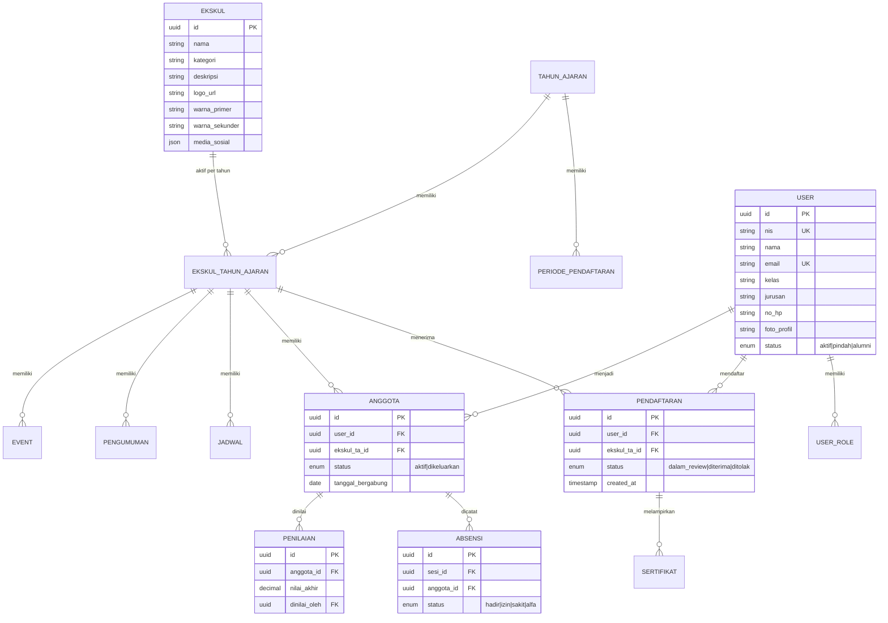
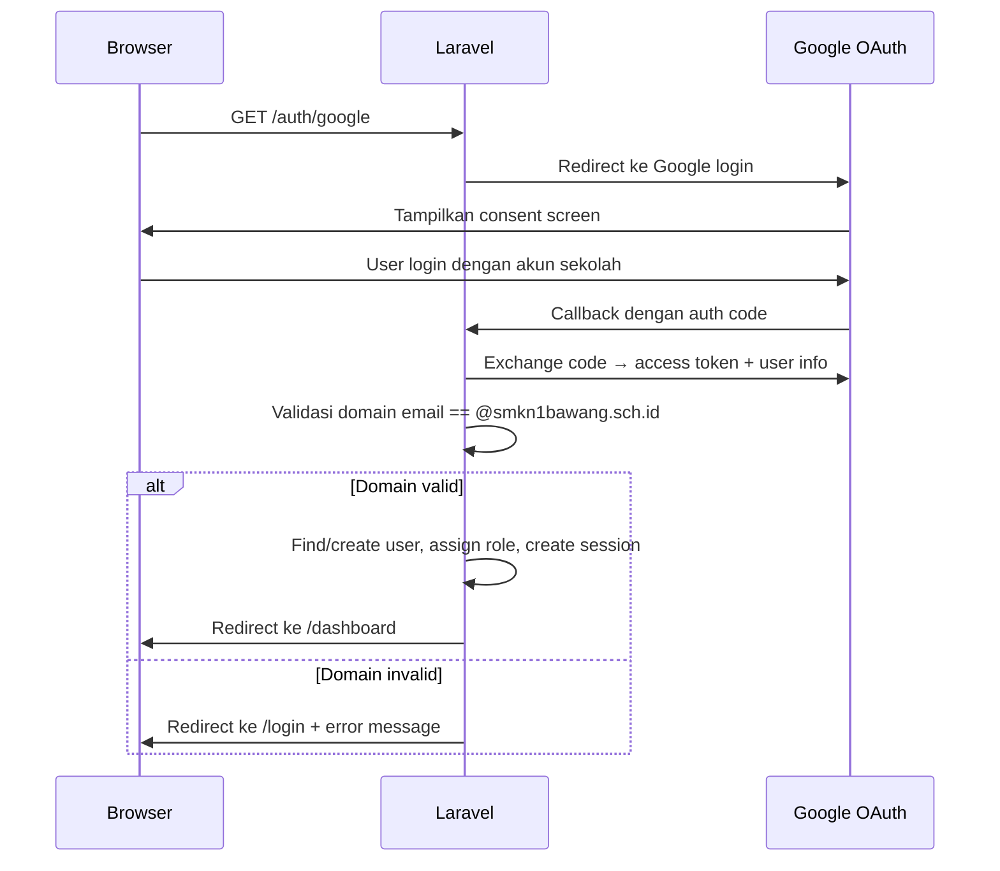

# Architecture Document
## Sistem Manajemen Ekstrakurikuler — SMKN 1 Bawang

> **Versi:** 1.0  
> **Tanggal:** 4 Juni 2026  
> **Status:** Final  
> **Referensi:** `docs/planning/srs.md`, `docs/architecture/tech-stack.md`

---

## 1. Ringkasan Arsitektur

Sistem menggunakan arsitektur **Monolith Modular** dengan Laravel 13 sebagai backend tunggal dan React 19 (via Inertia.js v3) sebagai frontend SPA. Tidak ada API REST terpisah — seluruh komunikasi client-server menggunakan protokol Inertia (XHR). Arsitektur ini dipilih karena skala sistem (1 sekolah, 2.000–5.000 siswa) tidak memerlukan microservices, dan monolith modular mempermudah deployment serta pemeliharaan oleh staf sekolah.

```
┌──────────────────────────────────────────────────────────────────────┐
│                        CLIENT (Browser)                              │
│              React 19 + Inertia.js v3 + Tailwind CSS v4              │
│  ┌──────────┐  ┌──────────┐  ┌──────────┐  ┌───────────────────┐    │
│  │ Pages/   │  │ Layouts/ │  │Components│  │ Hooks (useForm,   │    │
│  │ Dashboard│  │ App/Auth │  │ Shared   │  │  useHttp)         │    │
│  └──────────┘  └──────────┘  └──────────┘  └───────────────────┘    │
└────────────────────────────┬─────────────────────────────────────────┘
                             │  Inertia XHR (bukan REST API)
┌────────────────────────────▼─────────────────────────────────────────┐
│                      LARAVEL 13 (PHP 8.5)                            │
│                                                                      │
│  ┌─── Middleware Layer ──────────────────────────────────────────┐   │
│  │  Auth (Socialite) → RBAC (Spatie Permission) → Rate Limit    │   │
│  └──────────────────────────────────────────────────────────────┘   │
│                                                                      │
│  ┌─── Domain Modules ──────────────────────────────────────────┐    │
│  │                                                              │    │
│  │  ┌────────────┐ ┌────────────┐ ┌────────────┐              │    │
│  │  │ Auth       │ │ Ekskul     │ │ Pendaftaran│              │    │
│  │  │ Module     │ │ Module     │ │ Module     │              │    │
│  │  └────────────┘ └────────────┘ └────────────┘              │    │
│  │  ┌────────────┐ ┌────────────┐ ┌────────────┐              │    │
│  │  │ Seleksi    │ │ Anggota    │ │ Absensi    │              │    │
│  │  │ Module     │ │ Module     │ │ Module     │              │    │
│  │  └────────────┘ └────────────┘ └────────────┘              │    │
│  │  ┌────────────┐ ┌────────────┐ ┌────────────┐              │    │
│  │  │ Penilaian  │ │ Jadwal     │ │ Notifikasi │              │    │
│  │  │ Module     │ │ Module     │ │ Module     │              │    │
│  │  └────────────┘ └────────────┘ └────────────┘              │    │
│  │  ┌────────────┐ ┌────────────┐ ┌────────────┐              │    │
│  │  │ Laporan    │ │ TahunAjaran│ │ AuditLog   │              │    │
│  │  │ Module     │ │ Module     │ │ Module     │              │    │
│  │  └────────────┘ └────────────┘ └────────────┘              │    │
│  └──────────────────────────────────────────────────────────────┘    │
│                                                                      │
│  ┌─── Infrastructure Services ─────────────────────────────────┐    │
│  │  Queue Worker │ Task Scheduler │ File Storage │ Logging      │    │
│  └──────────────────────────────────────────────────────────────┘    │
└────────────────────────────┬─────────────────────────────────────────┘
                             │ Eloquent ORM (PDO mysql)
┌────────────────────────────▼─────────────────────────────────────────┐
│                        MySQL 8.4 LTS / 9.x                            │
│         Relational DB — Data Utama, Audit Log, RBAC                  │
└──────────────────────────────────────────────────────────────────────┘
```

---

## 2. Prinsip Arsitektur

| # | Prinsip | Penjelasan |
|---|---------|------------|
| P1 | **Single Deployment** | Satu aplikasi, satu server, satu database. Tidak ada microservices atau multi-region. |
| P2 | **Server-Side Authority** | Seluruh logika bisnis, RBAC, dan validasi berjalan di Laravel (server). Frontend hanya rendering. |
| P3 | **Tahun Ajaran sebagai Partition Key** | Seluruh data operasional (anggota, absensi, nilai, pendaftaran) dipartisi berdasarkan `tahun_ajaran_id`. |
| P4 | **Immutable Audit Trail** | Tabel `activity_log` bersifat append-only. Tidak ada endpoint DELETE/UPDATE. |
| P5 | **Domain Module Separation** | Kode diorganisir per domain bisnis (bukan per tipe file) untuk maintainability. |
| P6 | **Zero External Paid Services** | Hanya menggunakan Google OAuth (gratis) dan wa.me (gratis). Tidak ada layanan berbayar. |

---

## 3. Layer Architecture

### 3.1 Presentation Layer (Frontend)

| Aspek | Detail |
|---|---|
| **Runtime** | React 19 + TypeScript, di-bundle oleh Vite 6 |
| **Routing** | Dikendalikan oleh Laravel (server-side routing). Inertia.js menangani transisi halaman tanpa full reload. |
| **State Management** | Inertia page props (server-driven state). Tidak memerlukan Redux/Zustand. |
| **Styling** | Tailwind CSS v4 dengan `@theme {}` untuk design tokens. CSS Variables untuk warna dinamis per ekskul. |
| **Form Handling** | `useForm` hook dari Inertia.js v3 untuk form submission dengan validasi server-side. |
| **HTTP Requests** | `useHttp` hook dari Inertia.js v3 untuk request non-navigasi (polling notifikasi, dll). |

**Struktur halaman React:**

```
resources/js/
├── Pages/           # Halaman Inertia (1:1 dengan Laravel route)
│   ├── Auth/        # Login, callback Google OAuth
│   ├── Dashboard/   # Dashboard per role (Siswa, Admin, Pembina, dll)
│   ├── Ekskul/      # Profil, galeri, struktur organisasi
│   ├── Pendaftaran/ # Form pendaftaran, upload sertifikat
│   ├── Seleksi/     # Review pendaftar, input hasil seleksi
│   ├── Anggota/     # Kelola anggota, status, periode
│   ├── Absensi/     # Input & rekap absensi
│   ├── Penilaian/   # Bulk input nilai
│   ├── Jadwal/      # Kalender terpadu, deteksi bentrok
│   ├── Laporan/     # Generate & download PDF/Excel
│   └── Admin/       # Tahun ajaran, import siswa, audit log
├── Components/      # Komponen reusable (Button, Modal, Table, dll)
├── Layouts/         # Layout utama (AppLayout, AuthLayout, GuestLayout)
└── Hooks/           # Custom hooks
```

### 3.2 Application Layer (Backend)

Menggunakan pola **Controller → Service → Repository** untuk memisahkan tanggung jawab:

```
app/
├── Http/
│   ├── Controllers/         # Thin controllers — delegasi ke Service
│   │   ├── Auth/
│   │   ├── Ekskul/
│   │   ├── Pendaftaran/
│   │   ├── Seleksi/
│   │   ├── Anggota/
│   │   ├── Absensi/
│   │   ├── Penilaian/
│   │   ├── Jadwal/
│   │   ├── Laporan/
│   │   ├── Notifikasi/
│   │   └── Admin/
│   ├── Middleware/           # Auth, RBAC, EnsureTahunAjaranAktif
│   └── Requests/            # Form Request validation classes
├── Services/                # Business logic layer
├── Models/                  # Eloquent models
├── Policies/                # Authorization policies (Gate/Policy)
├── Jobs/                    # Queue jobs (ImportSiswa, GenerateLaporan)
├── Events/                  # Domain events (PendaftaranCreated, dll)
├── Listeners/               # Event listeners (NotifikasiDashboard, dll)
├── Exports/                 # Laravel Excel export classes
├── Imports/                 # Laravel Excel import classes
└── Console/
    └── Commands/            # Artisan commands (sertifikat:cleanup, dll)
```

### 3.3 Data Layer (Database)

MySQL 8.4 LTS / 9.x dengan Eloquent ORM. Seluruh tabel memiliki `tahun_ajaran_id` sebagai foreign key untuk partisi data per periode.

---

## 4. Domain Model & Entity Relationship

### 4.1 Entitas Utama



### 4.2 Tabel Pendukung

| Tabel | Fungsi | Catatan |
|---|---|---|
| `tahun_ajaran` | Entitas utama partisi data | `is_archived` flag untuk arsip |
| `periode_pendaftaran` | Periode buka/tutup pendaftaran | 1 per tahun ajaran |
| `struktur_organisasi` | Jabatan dalam ekskul | JSON-based, fleksibel per ekskul |
| `sesi_absensi` | Sesi latihan per tanggal | FK ke `ekskul_tahun_ajaran` |
| `album_foto` | Album galeri kegiatan | Publik, dapat diakses alumni |
| `foto` | File foto dalam album | FK ke `album_foto` |
| `notifikasi` | Notifikasi in-app siswa | Tipe: pendaftaran, seleksi, jadwal |
| `activity_log` | Audit log (Spatie) | **Immutable** — tidak ada DELETE |

---

## 5. Alur Request (Request Flow)

### 5.1 Alur Standar (Inertia Page Visit)

```
1. Browser GET /dashboard
2. → Laravel Router → Middleware Auth → Middleware RBAC
3. → DashboardController@index
4.   → DashboardService: ambil data sesuai role
5.   → Eloquent query dengan scope tahun_ajaran_aktif
6. → return Inertia::render('Dashboard/Siswa', $props)
7. → Inertia serialisasi props ke JSON
8. → React render <DashboardSiswa {...props} />
```

### 5.2 Alur Form Submit (Inertia Post)

```
1. User submit form pendaftaran
2. → useForm().post('/pendaftaran')
3. → Inertia XHR POST /pendaftaran
4. → Laravel Router → Middleware Auth → Middleware RBAC
5. → PendaftaranController@store
6.   → PendaftaranRequest validation (server-side)
7.   → PendaftaranService: cek periode aktif, simpan data
8.   → Event: PendaftaranCreated
9.   → Listener: CreateNotifikasiDashboard
10.  → ActivityLog: catat aksi
11. → redirect back (Inertia auto-refresh page props)
```

### 5.3 Alur Background Job (Import Excel)

```
1. Admin upload file Excel siswa
2. → ImportController@store → validasi file
3. → dispatch(new ImportSiswaJob($filePath))
4. → Response: "Import sedang diproses"
5. → Queue Worker picks up job
6.   → Laravel Excel: baca baris per batch (chunk)
7.   → Validasi setiap baris
8.   → Insert ke tabel users
9.   → ActivityLog: catat import
10. → Job complete → Notifikasi admin
```

---

## 6. Autentikasi & Otorisasi

### 6.1 Alur Google OAuth



### 6.2 RBAC (Role-Based Access Control)

Menggunakan **Spatie Laravel Permission v7**. Lima peran utama:

| Role | Scope | Contoh Permission |
|---|---|---|
| `siswa` | Global | `pendaftaran.create`, `profil.edit-self` |
| `admin-ekskul` | Per-ekskul | `ekskul.{id}.anggota.manage`, `ekskul.{id}.absensi.create` |
| `pengurus-osis` | Lintas-ekskul | `ekskul.*.manage`, `admin-ekskul.assign` |
| `pembina` | Per-ekskul | `ekskul.{id}.penilaian.create`, `laporan.export` |
| `kesiswaan` | Global | `tahun-ajaran.manage`, `import.siswa`, `audit-log.view` |

**Scope Admin Ekskul:** Diimplementasikan via pivot table `admin_ekskul_assignments` yang menghubungkan user_id dengan ekskul_id. Middleware `EnsureEkskulAccess` memvalidasi bahwa admin hanya mengakses ekskul yang ditugaskan.

### 6.3 Dual Role

Satu user dapat memiliki multiple roles. Contoh: siswa kelas 11 bisa punya role `siswa` + `admin-ekskul` (untuk ekskul tertentu). UI menampilkan context switcher jika user memiliki lebih dari satu peran aktif.

---

## 7. Strategi File Storage

| Jenis File | Lokasi | Retensi | Ukuran Maks |
|---|---|---|---|
| Sertifikat pendaftaran | `storage/app/sertifikat/{pendaftaran_id}/` | **Temporary** — dihapus setelah seleksi final | 2 MB/file |
| Logo/foto ekskul | `storage/app/public/ekskul/{ekskul_id}/` | Permanen | 2 MB/file |
| Album foto kegiatan | `storage/app/public/galeri/{album_id}/` | Permanen | 2 MB/file |
| Lampiran pengumuman | `storage/app/pengumuman/{pengumuman_id}/` | Permanen | 2 MB/file |
| Foto profil user | `storage/app/public/profil/{user_id}/` | Permanen | 2 MB/file |

**Cleanup sertifikat** dilakukan oleh scheduled command `sertifikat:cleanup` yang berjalan harian via Laravel Scheduler (`REQ-COMP-002`).

---

## 8. Notifikasi WhatsApp (wa.me)

Sistem **tidak** menggunakan API WhatsApp Business. Notifikasi menggunakan tautan `wa.me` yang di-generate otomatis:

```
https://wa.me/{nomor_hp}?text={pesan_terenkode}
```

**Alur pengiriman massal:**
1. Admin klik "Kirim Notifikasi WA" pada halaman hasil seleksi.
2. Sistem generate array tautan wa.me untuk setiap siswa terkait.
3. UI menampilkan daftar tautan yang dapat diklik satu per satu, atau admin menggunakan fitur "Buka Semua" yang membuka multiple tabs.

---

## 9. Strategi Caching & Performance

| Strategi | Implementasi |
|---|---|
| **Query Caching** | Cache hasil query daftar ekskul, kalender terpadu (invalidasi saat data berubah). |
| **Eager Loading** | Seluruh relasi Eloquent di-eager-load untuk menghindari N+1 query. |
| **Pagination** | Seluruh daftar (anggota, pendaftar, absensi) menggunakan cursor/offset pagination. |
| **Queue untuk Heavy Jobs** | Import Excel massal, generate laporan PDF/Excel diproses via Queue Worker. |
| **Asset Bundling** | Vite 6 dengan code splitting per route — hanya load JS yang diperlukan per halaman. |

---

## 10. Error Handling & Observability

| Aspek | Implementasi |
|---|---|
| **Server Error (5xx)** | Log stack trace ke `storage/logs/laravel.log`. Halaman error custom ditampilkan. |
| **Validation Error (422)** | Inertia.js otomatis menampilkan error di form field yang bermasalah. |
| **Auth Error (401/403)** | Redirect ke login (401) atau halaman forbidden (403). |
| **Upload Error** | Validasi client-side (ukuran, tipe) + server-side. File gagal tidak tersimpan (`REQ-REL-001`). |
| **Audit Log** | Spatie Activitylog mencatat WHO, WHAT, WHEN, IP Address pada setiap mutasi data kritis. |

---

## 11. Deployment Architecture

```
┌─────────────────────────────────────────────┐
│            VPS Linux (Ubuntu 24.04)          │
│            2 vCPU, 4 GB RAM, 50 GB SSD      │
│                                              │
│  ┌──────────────────┐  ┌──────────────────┐  │
│  │   Nginx / Caddy  │  │   PHP-FPM 8.5    │  │
│  │   (Reverse Proxy)│──│   (Laravel App)   │  │
│  └──────────────────┘  └──────────────────┘  │
│                                              │
│  ┌──────────────────┐  ┌──────────────────┐  │
│  │  Queue Worker    │  │  Cron Scheduler  │  │
│  │  (php artisan    │  │  (auto cleanup   │  │
│  │   queue:work)    │  │   & archive)     │  │
│  └──────────────────┘  └──────────────────┘  │
│                                              │
│  ┌──────────────────────────────────────────┐│
│  │           MySQL 8.4 LTS / 9.x            ││
│  │     (localhost, port 3306)                ││
│  └──────────────────────────────────────────┘│
└─────────────────────────────────────────────┘
```

**Single-server deployment** — Seluruh komponen (web server, PHP, database, queue worker) berjalan di satu VPS. Sesuai dengan prinsip P1 (Single Deployment) dan skala sistem yang hanya melayani satu sekolah.

---

## 12. Keamanan

| Area | Implementasi |
|---|---|
| **Autentikasi** | Google OAuth 2.0 + domain email validation |
| **Otorisasi** | Spatie Permission (RBAC) + Laravel Policy + server-side middleware |
| **CSRF** | Token CSRF bawaan Laravel pada semua POST/PUT/DELETE |
| **XSS** | React auto-escaping + Content Security Policy headers |
| **SQL Injection** | Eloquent ORM parameterized queries |
| **File Upload** | Validasi tipe MIME + ukuran di server, rename file ke UUID |
| **Audit** | Immutable activity log — append-only, no DELETE endpoint |
| **Session** | Server-side session (database/file driver), HttpOnly cookies |

---

## 13. Referensi Silang SRS → Arsitektur

| REQ ID | Requirement | Komponen Arsitektur |
|---|---|---|
| `REQ-FUNC-001` | Login Google domain sekolah | Auth Module + Socialite + domain filter |
| `REQ-FUNC-002` | RBAC | Spatie Permission + Middleware + Policy |
| `REQ-FUNC-003` | Dual role | Multi-role user + context switcher UI |
| `REQ-FUNC-020–025` | Pendaftaran ekskul | Pendaftaran Module + File Storage |
| `REQ-FUNC-030–033` | Seleksi | Seleksi Module + Notifikasi Module |
| `REQ-FUNC-040–042` | Manajemen anggota | Anggota Module + RBAC scope |
| `REQ-FUNC-050` | Absensi | Absensi Module |
| `REQ-FUNC-060` | Penilaian | Penilaian Module + Excel Export |
| `REQ-FUNC-080–081` | Jadwal & kalender | Jadwal Module + bentrok detection query |
| `REQ-FUNC-090` | Tahun ajaran | TahunAjaran Module + archive mechanism |
| `REQ-FUNC-100–101` | Laporan & audit | Laporan Module + Spatie Activitylog |
| `REQ-FUNC-110–111` | Notifikasi | Notifikasi Module + wa.me link generator |
| `REQ-PERF-003` | Import massal | Queue Worker + Laravel Excel `ShouldQueue` |
| `REQ-COMP-002` | Auto-delete sertifikat | Laravel Scheduler + Artisan command |
| `REQ-MAINT-001` | Warna ekskul dinamis | CSS Variables + Tailwind `@theme` |
