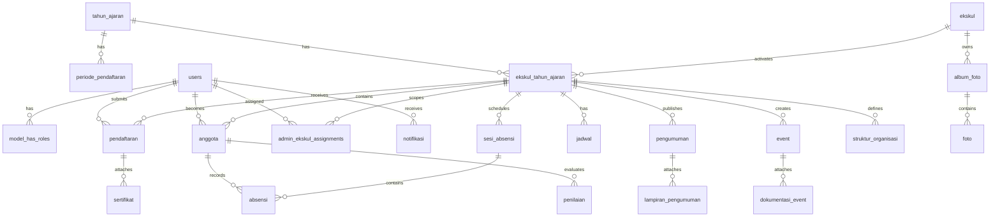

# Database Schema
## Sistem Manajemen Ekstrakurikuler — SMKN 1 Bawang

> **Versi:** 1.0  
> **Tanggal:** 4 Juni 2026  
> **Database:** MySQL 8.4 LTS / 9.x  
> **ORM:** Eloquent (Laravel 13)  
> **Referensi:** `architecture.md` Section 4, `srs.md` Appendix B & C

---

## 1. Konvensi

| Aspek | Aturan |
|---|---|
| **Primary Key** | UUID v7 (`uuid`), kolom `id` |
| **Timestamps** | Seluruh tabel memiliki `created_at` dan `updated_at` |
| **Soft Delete** | Hanya pada tabel `users` (`deleted_at`). Tabel lain menggunakan status enum. |
| **Naming** | snake_case untuk tabel dan kolom. Tabel pivot: `model_a_model_b` (urut alfabet). |
| **Foreign Key** | `{nama_tabel_singular}_id`, ON DELETE RESTRICT (default), ON DELETE CASCADE untuk tabel anak yang tidak memiliki arti tanpa parent. |
| **Enum** | Disimpan sebagai tipe ENUM bawaan MySQL. |
| **Index** | Composite index pada kolom yang sering difilter bersama (misal: `tahun_ajaran_id` + `ekskul_id`). |

---

## 2. Entity Relationship Diagram



---

## 3. Definisi Tabel

### 3.1 `tahun_ajaran` — Entitas Utama Partisi Data

Seluruh data operasional dipartisi oleh tahun ajaran. Hanya satu tahun ajaran yang aktif pada satu waktu.

| Kolom | Tipe | Constraint | Keterangan |
|---|---|---|---|
| `id` | uuid | PK | |
| `nama` | varchar(20) | NOT NULL, UNIQUE | Contoh: "2026/2027" |
| `tanggal_mulai` | date | NOT NULL | |
| `tanggal_selesai` | date | NOT NULL | |
| `is_aktif` | boolean | NOT NULL, DEFAULT false | Hanya 1 row boleh `true` |
| `is_archived` | boolean | NOT NULL, DEFAULT false | Read-only setelah arsip |
| `created_at` | timestamp | | |
| `updated_at` | timestamp | | |

**Constraint:** `CHECK` — hanya satu baris dengan `is_aktif = true`.

---

### 3.2 `users` — Data Siswa, Guru, dan Staf

Sesuai SRS Appendix B. Semua pengguna sistem disimpan di satu tabel.

| Kolom | Tipe | Constraint | Keterangan |
|---|---|---|---|
| `id` | uuid | PK | |
| `nis` | varchar(20) | UNIQUE, NULLABLE | NULL untuk guru/staf |
| `nama` | varchar(255) | NOT NULL | |
| `email` | varchar(255) | NOT NULL, UNIQUE | Email domain sekolah |
| `google_id` | varchar(255) | UNIQUE, NULLABLE | Google OAuth subject ID |
| `kelas` | varchar(10) | NULLABLE | "10 RPL 1", "11 TKJ 2", dll. NULL untuk guru/staf |
| `jurusan` | varchar(50) | NULLABLE | 1 dari 8 jurusan. NULL untuk guru/staf |
| `jenis_kelamin` | enum('L','P') | NOT NULL | |
| `no_hp` | varchar(20) | NULLABLE | Dapat diubah sendiri oleh siswa |
| `foto_profil` | varchar(500) | NULLABLE | URL path |
| `status` | enum('aktif','pindah_sekolah','alumni') | NOT NULL, DEFAULT 'aktif' | |
| `email_verified_at` | timestamp | NULLABLE | |
| `remember_token` | varchar(100) | NULLABLE | Laravel session |
| `created_at` | timestamp | | |
| `updated_at` | timestamp | | |
| `deleted_at` | timestamp | NULLABLE | Soft delete |

**Index:**
- `idx_users_email` — UNIQUE pada `email`
- `idx_users_nis` — UNIQUE pada `nis` (WHERE nis IS NOT NULL)
- `idx_users_status` — pada `status`
- `idx_users_kelas` — pada `kelas`

---

### 3.3 `ekskul` — Data Master 27 Ekstrakurikuler

Data master ekskul yang tidak bergantung pada tahun ajaran.

| Kolom | Tipe | Constraint | Keterangan |
|---|---|---|---|
| `id` | uuid | PK | |
| `nama` | varchar(100) | NOT NULL | Dapat diubah |
| `kategori` | varchar(50) | NOT NULL | Olahraga, Seni, Akademik, dll |
| `deskripsi` | text | NULLABLE | |
| `logo_url` | varchar(500) | NULLABLE | Path ke file logo |
| `warna_primer` | varchar(7) | DEFAULT '#fff000' | Hex color |
| `warna_sekunder` | varchar(7) | DEFAULT '#00a2e9' | Hex color |
| `media_sosial` | jsonb | NULLABLE | `{"instagram":"@...", "tiktok":"@..."}` |
| `is_active` | boolean | NOT NULL, DEFAULT true | |
| `created_at` | timestamp | | |
| `updated_at` | timestamp | | |

---

### 3.4 `ekskul_tahun_ajaran` — Ekskul Aktif per Tahun Ajaran

Pivot table yang mengaktifkan ekskul pada tahun ajaran tertentu. Seluruh data operasional (pendaftaran, anggota, absensi, dll) merujuk ke tabel ini.

| Kolom | Tipe | Constraint | Keterangan |
|---|---|---|---|
| `id` | uuid | PK | |
| `ekskul_id` | uuid | FK → ekskul.id, NOT NULL | |
| `tahun_ajaran_id` | uuid | FK → tahun_ajaran.id, NOT NULL | |
| `kuota_anggota` | integer | NULLABLE | Diisi setelah seleksi |
| `is_pendaftaran_dibuka` | boolean | DEFAULT false | Flag buka/tutup form |
| `is_seleksi_final` | boolean | DEFAULT false | Lock setelah seleksi selesai |
| `created_at` | timestamp | | |
| `updated_at` | timestamp | | |

**Constraint:** UNIQUE(`ekskul_id`, `tahun_ajaran_id`)

---

### 3.5 `periode_pendaftaran` — Konfigurasi Periode

Satu periode pendaftaran per tahun ajaran (`REQ-FUNC-020`).

| Kolom | Tipe | Constraint | Keterangan |
|---|---|---|---|
| `id` | uuid | PK | |
| `tahun_ajaran_id` | uuid | FK → tahun_ajaran.id, UNIQUE, NOT NULL | 1:1 per tahun ajaran |
| `tanggal_buka` | datetime | NOT NULL | |
| `tanggal_tutup` | datetime | NOT NULL | |
| `created_at` | timestamp | | |
| `updated_at` | timestamp | | |

---

### 3.6 `pendaftaran` — Formulir Pendaftaran Siswa

| Kolom | Tipe | Constraint | Keterangan |
|---|---|---|---|
| `id` | uuid | PK | |
| `user_id` | uuid | FK → users.id, NOT NULL | Siswa pendaftar |
| `ekskul_ta_id` | uuid | FK → ekskul_tahun_ajaran.id, NOT NULL | Target ekskul + tahun ajaran |
| `status` | enum('dalam_review','diterima','ditolak') | NOT NULL, DEFAULT 'dalam_review' | `REQ-FUNC-030` |
| `catatan_internal` | text | NULLABLE | Catatan admin (bukan alasan tolak) |
| `diputuskan_oleh` | uuid | FK → users.id, NULLABLE | Admin/Pembina yang memutuskan |
| `diputuskan_pada` | timestamp | NULLABLE | Waktu keputusan seleksi |
| `created_at` | timestamp | | |
| `updated_at` | timestamp | | |

**Constraint:** UNIQUE(`user_id`, `ekskul_ta_id`) — satu siswa hanya 1 pendaftaran per ekskul per tahun.  
**Index:** `idx_pendaftaran_status` — pada `status`

---

### 3.7 `sertifikat` — Lampiran File Pendaftaran

File bersifat temporary — dihapus otomatis setelah seleksi final (`REQ-COMP-002`).

| Kolom | Tipe | Constraint | Keterangan |
|---|---|---|---|
| `id` | uuid | PK | |
| `pendaftaran_id` | uuid | FK → pendaftaran.id, ON DELETE CASCADE, NOT NULL | |
| `nama_file` | varchar(255) | NOT NULL | Nama asli file |
| `path` | varchar(500) | NOT NULL | Path di storage |
| `mime_type` | varchar(50) | NOT NULL | pdf, jpg, jpeg, png |
| `ukuran_bytes` | integer | NOT NULL | Maks 2.097.152 (2 MB) |
| `created_at` | timestamp | | |
| `updated_at` | timestamp | | |

---

### 3.8 `anggota` — Keanggotaan Ekskul

Dibuat setelah pendaftaran berstatus "diterima" atau ditambahkan manual (`REQ-FUNC-025`).

| Kolom | Tipe | Constraint | Keterangan |
|---|---|---|---|
| `id` | uuid | PK | |
| `user_id` | uuid | FK → users.id, NOT NULL | |
| `ekskul_ta_id` | uuid | FK → ekskul_tahun_ajaran.id, NOT NULL | |
| `status` | enum('aktif','dikeluarkan') | NOT NULL, DEFAULT 'aktif' | `REQ-FUNC-040` |
| `tanggal_bergabung` | date | NOT NULL | |
| `tanggal_dikeluarkan` | date | NULLABLE | |
| `dikeluarkan_oleh` | uuid | FK → users.id, NULLABLE | |
| `sumber` | enum('seleksi','manual') | NOT NULL, DEFAULT 'seleksi' | Asal keanggotaan |
| `created_at` | timestamp | | |
| `updated_at` | timestamp | | |

**Constraint:** UNIQUE(`user_id`, `ekskul_ta_id`)  
**Index:** `idx_anggota_status` — pada `status`

---

### 3.9 `sesi_absensi` — Sesi Latihan/Pertemuan

| Kolom | Tipe | Constraint | Keterangan |
|---|---|---|---|
| `id` | uuid | PK | |
| `ekskul_ta_id` | uuid | FK → ekskul_tahun_ajaran.id, NOT NULL | |
| `tanggal` | date | NOT NULL | |
| `keterangan` | varchar(255) | NULLABLE | Misal: "Latihan rutin minggu ke-5" |
| `dibuat_oleh` | uuid | FK → users.id, NOT NULL | Admin yang membuat sesi |
| `created_at` | timestamp | | |
| `updated_at` | timestamp | | |

---

### 3.10 `absensi` — Record Kehadiran per Anggota per Sesi

| Kolom | Tipe | Constraint | Keterangan |
|---|---|---|---|
| `id` | uuid | PK | |
| `sesi_absensi_id` | uuid | FK → sesi_absensi.id, ON DELETE CASCADE, NOT NULL | |
| `anggota_id` | uuid | FK → anggota.id, NOT NULL | |
| `status` | enum('hadir','izin','sakit','alfa') | NOT NULL | `REQ-FUNC-050` |
| `created_at` | timestamp | | |
| `updated_at` | timestamp | | |

**Constraint:** UNIQUE(`sesi_absensi_id`, `anggota_id`)

---

### 3.11 `penilaian` — Nilai Akhir Anggota

Satu nilai akhir per anggota per ekskul per tahun ajaran (`REQ-FUNC-060`).

| Kolom | Tipe | Constraint | Keterangan |
|---|---|---|---|
| `id` | uuid | PK | |
| `anggota_id` | uuid | FK → anggota.id, UNIQUE, NOT NULL | 1 nilai per anggota |
| `nilai_akhir` | decimal(5,2) | NOT NULL | 0.00 – 100.00 |
| `dinilai_oleh` | uuid | FK → users.id, NOT NULL | Admin/Pembina/Kesiswaan |
| `created_at` | timestamp | | |
| `updated_at` | timestamp | | |

---

### 3.12 `jadwal` — Jadwal Latihan Rutin Ekskul

| Kolom | Tipe | Constraint | Keterangan |
|---|---|---|---|
| `id` | uuid | PK | |
| `ekskul_ta_id` | uuid | FK → ekskul_tahun_ajaran.id, NOT NULL | |
| `hari` | enum('senin','selasa','rabu','kamis','jumat','sabtu','minggu') | NOT NULL | |
| `jam_mulai` | time | NOT NULL | |
| `jam_selesai` | time | NOT NULL | |
| `lokasi` | varchar(255) | NULLABLE | |
| `keterangan` | varchar(255) | NULLABLE | |
| `created_at` | timestamp | | |
| `updated_at` | timestamp | | |

> Jadwal antar ekskul **boleh bentrok** (`REQ-FUNC-080`). Deteksi bentrok dilakukan via query saat menampilkan kalender siswa.

---

### 3.13 `pengumuman` — Pengumuman Internal Ekskul

| Kolom | Tipe | Constraint | Keterangan |
|---|---|---|---|
| `id` | uuid | PK | |
| `ekskul_ta_id` | uuid | FK → ekskul_tahun_ajaran.id, NOT NULL | |
| `judul` | varchar(255) | NOT NULL | |
| `konten` | text | NOT NULL | |
| `dijadwalkan_pada` | datetime | NULLABLE | NULL = langsung terbit |
| `diterbitkan_pada` | datetime | NULLABLE | NULL = belum terbit |
| `dibuat_oleh` | uuid | FK → users.id, NOT NULL | |
| `created_at` | timestamp | | |
| `updated_at` | timestamp | | |

---

### 3.14 `lampiran_pengumuman` — File Lampiran Pengumuman

| Kolom | Tipe | Constraint | Keterangan |
|---|---|---|---|
| `id` | uuid | PK | |
| `pengumuman_id` | uuid | FK → pengumuman.id, ON DELETE CASCADE, NOT NULL | |
| `nama_file` | varchar(255) | NOT NULL | |
| `path` | varchar(500) | NOT NULL | |
| `mime_type` | varchar(50) | NOT NULL | |
| `ukuran_bytes` | integer | NOT NULL | |
| `created_at` | timestamp | | |

---

### 3.15 `event` — Event Informasi Ekskul

Event bersifat informasi saja — tanpa manajemen peserta (`REQ-FUNC-071`).

| Kolom | Tipe | Constraint | Keterangan |
|---|---|---|---|
| `id` | uuid | PK | |
| `ekskul_ta_id` | uuid | FK → ekskul_tahun_ajaran.id, NOT NULL | |
| `judul` | varchar(255) | NOT NULL | |
| `deskripsi` | text | NOT NULL | |
| `tanggal_mulai` | datetime | NOT NULL | |
| `tanggal_selesai` | datetime | NULLABLE | |
| `lokasi` | varchar(255) | NULLABLE | |
| `link_wa_eo` | varchar(500) | NULLABLE | Tautan WhatsApp event organizer |
| `dibuat_oleh` | uuid | FK → users.id, NOT NULL | |
| `created_at` | timestamp | | |
| `updated_at` | timestamp | | |

---

### 3.16 `dokumentasi_event` — Foto Dokumentasi Event

| Kolom | Tipe | Constraint | Keterangan |
|---|---|---|---|
| `id` | uuid | PK | |
| `event_id` | uuid | FK → event.id, ON DELETE CASCADE, NOT NULL | |
| `path` | varchar(500) | NOT NULL | |
| `caption` | varchar(255) | NULLABLE | |
| `created_at` | timestamp | | |

---

### 3.17 `album_foto` — Album Galeri Kegiatan (Publik)

| Kolom | Tipe | Constraint | Keterangan |
|---|---|---|---|
| `id` | uuid | PK | |
| `ekskul_id` | uuid | FK → ekskul.id, NOT NULL | FK ke master ekskul (bukan per tahun) |
| `judul` | varchar(255) | NOT NULL | |
| `deskripsi` | text | NULLABLE | |
| `dibuat_oleh` | uuid | FK → users.id, NOT NULL | |
| `created_at` | timestamp | | |
| `updated_at` | timestamp | | |

> Album foto bersifat **publik** dan dapat diakses tanpa login (`REQ-FUNC-012`).

---

### 3.18 `foto` — File Foto dalam Album

| Kolom | Tipe | Constraint | Keterangan |
|---|---|---|---|
| `id` | uuid | PK | |
| `album_foto_id` | uuid | FK → album_foto.id, ON DELETE CASCADE, NOT NULL | |
| `path` | varchar(500) | NOT NULL | |
| `caption` | varchar(255) | NULLABLE | |
| `urutan` | integer | DEFAULT 0 | Untuk sorting tampilan |
| `created_at` | timestamp | | |

---

### 3.19 `struktur_organisasi` — Jabatan dalam Ekskul

Struktur fleksibel per ekskul (`REQ-FUNC-011`).

| Kolom | Tipe | Constraint | Keterangan |
|---|---|---|---|
| `id` | uuid | PK | |
| `ekskul_ta_id` | uuid | FK → ekskul_tahun_ajaran.id, NOT NULL | |
| `anggota_id` | uuid | FK → anggota.id, NOT NULL | |
| `jabatan` | varchar(100) | NOT NULL | Misal: "Ketua", "Sekretaris", "Bendahara" |
| `urutan` | integer | DEFAULT 0 | Urutan hierarki |
| `created_at` | timestamp | | |
| `updated_at` | timestamp | | |

---

### 3.20 `notifikasi` — Notifikasi In-App untuk Siswa

| Kolom | Tipe | Constraint | Keterangan |
|---|---|---|---|
| `id` | uuid | PK | |
| `user_id` | uuid | FK → users.id, NOT NULL | Penerima |
| `tipe` | enum('pendaftaran_berhasil','jadwal_berubah','seleksi_diterima','seleksi_ditolak','pengumuman','umum') | NOT NULL | |
| `judul` | varchar(255) | NOT NULL | |
| `pesan` | text | NOT NULL | |
| `link` | varchar(500) | NULLABLE | Deep link ke halaman terkait |
| `is_read` | boolean | NOT NULL, DEFAULT false | |
| `created_at` | timestamp | | |

**Index:** `idx_notifikasi_user_read` — pada (`user_id`, `is_read`)

---

### 3.21 `admin_ekskul_assignments` — Scope Admin Ekskul

Menghubungkan user (dengan role admin-ekskul/pembina) ke ekskul spesifik yang boleh dikelola.

| Kolom | Tipe | Constraint | Keterangan |
|---|---|---|---|
| `id` | uuid | PK | |
| `user_id` | uuid | FK → users.id, NOT NULL | |
| `ekskul_ta_id` | uuid | FK → ekskul_tahun_ajaran.id, NOT NULL | |
| `ditugaskan_oleh` | uuid | FK → users.id, NOT NULL | Pengurus OSIS / Kesiswaan |
| `created_at` | timestamp | | |

**Constraint:** UNIQUE(`user_id`, `ekskul_ta_id`)

---

### 3.22 Tabel Spatie (Auto-generated)

Tabel berikut di-generate otomatis oleh package Spatie dan **tidak boleh dimodifikasi** secara manual.

#### `roles` & `permissions` (Spatie Permission v7)

| Tabel | Fungsi |
|---|---|
| `roles` | Definisi peran: siswa, admin-ekskul, pengurus-osis, pembina, kesiswaan |
| `permissions` | Definisi permission granular |
| `model_has_roles` | Pivot user ↔ role |
| `model_has_permissions` | Pivot user ↔ permission (direct) |
| `role_has_permissions` | Pivot role ↔ permission |

#### `activity_log` (Spatie Activitylog v5)

| Kolom Penting | Keterangan |
|---|---|
| `log_name` | Kategori log |
| `description` | Deskripsi aksi |
| `subject_type` / `subject_id` | Model yang terpengaruh |
| `causer_type` / `causer_id` | User yang melakukan aksi (WHO) |
| `properties` | JSON — old values & new values (WHAT) |
| `created_at` | Timestamp aksi (WHEN) |

> **IMMUTABLE** — Tidak ada endpoint DELETE atau UPDATE untuk tabel ini (`REQ-SEC-003`). Konfigurasi: `delete_records_older_than_days => null`.

---

## 4. Query Deteksi Bentrok Jadwal

Berikut contoh query SQL (kompatibel dengan MySQL) untuk mendeteksi bentrok jadwal seorang siswa (`REQ-FUNC-080`):

```sql
SELECT 
    j1.id AS jadwal_a,
    e1.nama AS ekskul_a,
    j2.id AS jadwal_b,
    e2.nama AS ekskul_b,
    j1.hari,
    j1.jam_mulai,
    j1.jam_selesai
FROM jadwal j1
JOIN ekskul_tahun_ajaran eta1 ON j1.ekskul_ta_id = eta1.id
JOIN ekskul e1 ON eta1.ekskul_id = e1.id
JOIN anggota a1 ON a1.ekskul_ta_id = eta1.id AND a1.status = 'aktif'
JOIN jadwal j2 ON j2.id != j1.id AND j2.hari = j1.hari
JOIN ekskul_tahun_ajaran eta2 ON j2.ekskul_ta_id = eta2.id
JOIN ekskul e2 ON eta2.ekskul_id = e2.id
JOIN anggota a2 ON a2.ekskul_ta_id = eta2.id AND a2.status = 'aktif'
WHERE a1.user_id = :user_id
  AND a2.user_id = :user_id
  AND eta1.tahun_ajaran_id = :tahun_ajaran_aktif
  AND eta2.tahun_ajaran_id = :tahun_ajaran_aktif
  AND j1.jam_mulai < j2.jam_selesai
  AND j2.jam_mulai < j1.jam_selesai
  AND j1.id < j2.id;  -- avoid duplicates
```

---

## 5. Ringkasan Jumlah Tabel

| Kategori | Tabel | Jumlah |
|---|---|---|
| **Core** | tahun_ajaran, users, ekskul, ekskul_tahun_ajaran | 4 |
| **Pendaftaran** | periode_pendaftaran, pendaftaran, sertifikat | 3 |
| **Keanggotaan** | anggota, struktur_organisasi, admin_ekskul_assignments | 3 |
| **Operasional** | sesi_absensi, absensi, penilaian, jadwal | 4 |
| **Konten** | pengumuman, lampiran_pengumuman, event, dokumentasi_event, album_foto, foto | 6 |
| **Sistem** | notifikasi | 1 |
| **Spatie (auto)** | roles, permissions, model_has_roles, model_has_permissions, role_has_permissions, activity_log | 6 |
| **Total** | | **27** |
