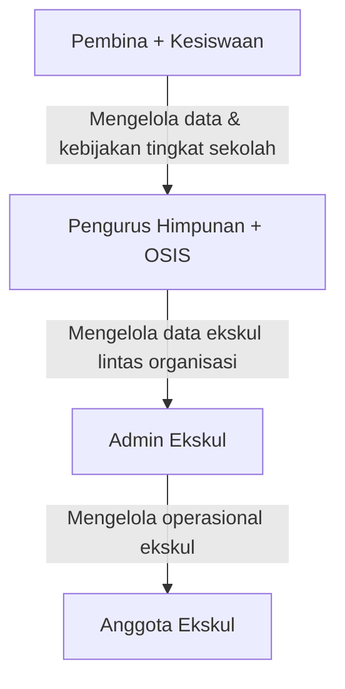

# Product Requirements Document (PRD)
# Sistem Manajemen Ekstrakurikuler — SMKN 1 Bawang

> **Versi:** 1.0
> **Tanggal:** 3 Juni 2026
> **Status:** Draft
> **Source of Truth:** FAQ-dengan-client.md

> [!IMPORTANT]
> Seluruh keputusan produk dalam dokumen ini bersumber dari FAQ klien sebagai **source of truth mutlak**. Jika ada konflik antara PRD ini dengan FAQ, FAQ yang berlaku.

---

## 1. Visi & Tujuan Produk 🎯

### 1.1 Visi
Membangun platform manajemen ekstrakurikuler digital terpadu untuk SMKN 1 Bawang yang menyederhanakan seluruh siklus pengelolaan ekskul — mulai dari pendaftaran, seleksi, pengelolaan anggota, absensi, penilaian, hingga pelaporan — dalam satu sistem yang responsif dan mudah digunakan.

### 1.2 Tujuan
- Mendigitalisasi proses pendaftaran dan seleksi 27 ekskul
- Menyediakan tools pengelolaan operasional ekskul bagi Admin Ekskul, Pengurus Himpunan + OSIS, Pembina, dan Kesiswaan
- Menyediakan dashboard informatif bagi siswa untuk memantau kegiatan ekskul
- Mendukung arsip data antar tahun ajaran
- Menyediakan sistem pelaporan dan audit yang transparan

### 1.3 Ruang Lingkup
- **Satu sekolah saja** — SMKN 1 Bawang (tidak multi-tenant, tidak berpotensi digunakan sekolah lain)
- **Skala:** Mendukung 2.000–5.000 siswa
- **Platform:** Web application, responsif untuk mobile, tablet, dan desktop
- **Tanpa dark mode** — tidak dibutuhkan oleh siswa

---

## 2. Persona Pengguna & User Journey 👥

### 2.1 Persona

| Persona | Deskripsi | Tingkat Kelas | Akses Login |
|---|---|---|---|
| **Siswa (Peserta)** | Kelas 10, mendaftar dan mengikuti ekskul | Kelas 10 | Google sekolah (domain sekolah) |
| **Admin Ekskul** | Kelas 11, mengelola operasional ekskul tertentu | Kelas 11 | Google sekolah (domain sekolah) |
| **Pengurus Himpunan + OSIS** | Kelas 11, mengelola data ekskul lintas organisasi | Kelas 11 | Google sekolah (domain sekolah) |
| **Pembina** | Guru pembina ekskul, mengelola data dan kebijakan | Guru | Google sekolah (domain sekolah) |
| **Kesiswaan** | Staf kesiswaan, mengelola kebijakan tingkat sekolah | Staf | Google sekolah (domain sekolah) |
| **Alumni** | Siswa yang sudah lulus | - | Google sekolah (hanya lihat album foto, email tidak aktif setelah lulus) |

> [!NOTE]
> - Satu siswa **dapat** menjadi anggota di satu ekskul sekaligus Admin Ekskul di ekskul lain
> - Admin Ekskul **hanya** boleh mengelola ekskulnya sendiri, tetapi satu orang boleh mengelola beberapa ekskul
> - Kelas 10 yang naik ke kelas 11 **tidak** otomatis menjadi Admin Ekskul — dipilih manual oleh admin ekskul sebelumnya
> - Pengurus Himpunan + OSIS baru dipilih oleh pengurus sebelumnya

### 2.2 User Journey Utama

#### Journey 1: Siswa Mendaftar Ekskul
```
Login Google → Dashboard Siswa → Jelajah Ekskul → Pilih Ekskul →
Isi Form Pendaftaran (+ Upload Sertifikat opsional) → Submit →
Notifikasi Pendaftaran Berhasil → Menunggu Seleksi →
Notifikasi Hasil (Diterima/Ditolak via Dashboard + WhatsApp)
```

#### Journey 2: Admin Ekskul Mengelola Seleksi
```
Login Google → Dashboard Admin → Lihat Daftar Pendaftar →
Review Berkas (Sertifikat) → Tentukan Status (Diterima/Ditolak) →
Umumkan Hasil → Kelola Anggota Aktif
```

#### Journey 3: Pembina/Kesiswaan Supervisi
```
Login Google → Dashboard Pembina → Monitor Ekskul →
Input Penilaian → Generate Laporan → Unduh PDF/Excel
```

---

## 3. Data Siswa 📋

### 3.1 Atribut Data Siswa

| Field | Keterangan |
|---|---|
| NIS | Unik, tidak berubah |
| Nama lengkap | — |
| Kelas | Kelas 10 (peserta) / Kelas 11 (panitia/pengurus) |
| Jurusan | 8 jurusan tersedia, tidak dapat berubah (hanya developer) |
| Jenis kelamin | — |
| Nomor HP | Dapat diubah sendiri oleh siswa |
| Email sekolah | Hanya domain sekolah, perubahan hanya oleh developer |
| Foto profil | Dari Google atau upload manual |

### 3.2 Import Data Siswa
- Data siswa diimpor via **Excel dan PDF** (bukan input manual per-siswa)
- Import massal didukung sebagai fitur utama

### 3.3 Status Siswa Khusus
- **Pindah Sekolah** — status khusus jika siswa pindah
- **Alumni/Lulus** — hanya dapat melihat album foto kegiatan; email sekolah tidak aktif setelah lulus

---

## 4. Breakdown Fitur (MoSCoW) 🛠️

### 4.1 Must-Have (P0) — MVP

#### F01: Autentikasi Google OAuth
- Login via akun Google sekolah (domain sekolah saja)
- Role-based access: Siswa, Admin Ekskul, Pengurus Himpunan + OSIS, Pembina, Kesiswaan
- Perubahan akun Google hanya oleh developer

#### F02: Manajemen Data Ekskul
- 27 ekskul dengan data: nama, kategori, logo/foto, deskripsi, media sosial
- Nama ekskul dapat diubah
- Warna/branding per ekskul dapat dikonfigurasi (default: warna design system)
- Struktur organisasi ekskul yang dapat dikonfigurasi oleh pengelola

#### F03: Pendaftaran Ekskul
- Periode pendaftaran: **1x per tahun ajaran**, diatur oleh admin
- **Tidak ada batas maksimal** pilihan ekskul per siswa (karena ada proses seleksi)
- **Tidak ada kuota pendaftaran** (kuota berlaku setelah seleksi)
- Syarat pendaftaran: tergantung masing-masing ekskul (bisa ada/tidak)
- Siswa **boleh** mengganti pilihan selama seleksi belum final
- Siswa terlambat: **tidak** melalui pendaftaran biasa, hanya penambahan manual oleh Admin Ekskul / Pengurus Himpunan + OSIS
- Pendaftaran **tidak wajib** — siswa bebas tidak memilih ekskul

#### F04: Upload Sertifikat
- Mendukung upload sertifikat pada pendaftaran
- Satu pendaftaran **dapat memiliki banyak sertifikat**
- Format: PDF, JPG, JPEG, PNG
- Ukuran maksimal: **2 MB** per file
- Sertifikat yang sudah diunggah **boleh diganti**
- Sertifikat **tidak disimpan selamanya** — hanya selama proses pendaftaran
- Tidak ada proses verifikasi formal, berkas hanya dilihat oleh pengelola

#### F05: Seleksi
- Status seleksi: **Diterima** atau **Ditolak** saja (tanpa nilai seleksi)
- **Tidak ada waiting list/status cadangan**
- **Tidak perlu** mencatat alasan penolakan
- Kuota setelah seleksi diinput oleh Admin Ekskul
- Satu siswa **boleh diterima di beberapa ekskul**
- Penentuan hasil seleksi oleh: Admin Ekskul dan Pembina + Kesiswaan

#### F06: Manajemen Anggota Ekskul
- Anggota ekskul dikelola pada sistem yang sama setelah diterima
- Anggota memiliki **periode keanggotaan**
- Data anggota lama **tetap disimpan** (untuk absensi dan laporan)
- Status anggota: **aktif** atau **dikeluarkan** (tidak ada status nonaktif)
- Siswa **tidak boleh** mengundurkan diri secara mandiri — hanya Admin Ekskul yang mengubah status
- Alumni ekskul **tidak disimpan**

#### F07: Absensi
- Fitur absensi yang **dapat dikonfigurasi**
- Status absensi: Hadir, Izin, Sakit, Alfa

#### F08: Penilaian Anggota
- Diisi oleh Admin Ekskul atau Pembina + Kesiswaan
- Bentuk: input manual dengan **satu nilai akhir**
- Mendukung **bulk input**

#### F09: Notifikasi & Pengumuman
- Pengumuman hasil seleksi di **Dashboard dan WhatsApp**
- Notifikasi siswa saat:
  - Pendaftaran berhasil ✓
  - Jadwal seleksi berubah ✓
  - Diterima ✓
  - Ditolak ✓
- Sistem WhatsApp: **semi-otomatis** dengan pesan tergenerate otomatis
- Mendukung **pengiriman WhatsApp massal**

#### F10: Tahun Ajaran
- Tahun ajaran sebagai **entitas utama** sistem
- Pengurus ekskul **berubah setiap tahun**
- Data tahun sebelumnya **dapat diarsipkan**
- Sistem harus siap digunakan saat tahun ajaran baru dimulai

#### F11: Import Data Massal
- Import data siswa via Excel dan PDF
- Import Excel massal untuk berbagai kebutuhan data

#### F12: Laporan & Audit
- Laporan dalam format: **PDF dan Excel**
- Pengguna laporan: Admin Ekskul, Pengurus Himpunan + OSIS, Pembina, Kesiswaan
- **Audit log** yang tidak boleh dihapus
- Audit log otomatis terarsip saat user menjadi alumni
- Riwayat aktivitas anggota disimpan, otomatis terarsip saat menjadi alumni

### 4.2 Should-Have (P1)

#### F13: Ekskul — Pengumuman Internal
- Ekskul dapat membuat pengumuman sendiri
- Pengumuman dapat memiliki **lampiran**
- Pengumuman dapat **dijadwalkan**

#### F14: Event & Kegiatan
- Ekskul dapat membuat event
- Event **tidak memiliki peserta** — hanya sebagai media informasi
- Konten event: informasi kegiatan + tautan WhatsApp event organizer
- Event memiliki **dokumentasi**

#### F15: Galeri & Album Foto
- Ekskul memiliki galeri kegiatan
- Galeri memiliki **album**
- Album foto bersifat **publik**
- Alumni yang sudah lulus hanya bisa melihat album foto kegiatan

#### F16: Jadwal & Kalender
- Ekskul memiliki jadwal
- Jadwal ekskul **boleh bentrok**
- Sistem **dapat mendeteksi** bentrok jadwal
- Admin **dapat melihat** bentrok jadwal siswa
- **Kalender terpadu** tersedia

#### F17: Dashboard Personalisasi Siswa
- Dashboard siswa **dapat dipersonalisasi**

#### F18: Pencarian Global
- Fitur pencarian global tersedia di seluruh sistem

### 4.3 Could-Have (P2)

#### F19: Ranking Ekskul Terfavorit
- Menampilkan peringkat ekskul berdasarkan popularitas/jumlah pendaftar

### 4.4 Won't-Have (Out of Scope)

| Item | Alasan (sesuai FAQ) |
|---|---|
| Multi-sekolah / multi-tenant | Hanya untuk satu sekolah, tidak berpotensi digunakan sekolah lain |
| Dark mode | Tidak dibutuhkan oleh siswa |
| Nilai seleksi / scoring | Hanya status diterima/ditolak |
| Waiting list / status cadangan | Tidak ada |
| Alasan penolakan | Tidak perlu dicatat |
| Status anggota nonaktif | Hanya aktif atau dikeluarkan |
| Penyimpanan alumni ekskul | Tidak disimpan |
| Self-resign anggota | Hanya Admin Ekskul yang mengubah status |
| Verifikasi berkas formal | Tidak ada proses verifikasi |
| Kuota pendaftaran | Kuota hanya setelah seleksi |
| Batas maksimal pilihan ekskul | Tidak ada batas |

---

## 5. Pengelolaan & Organisasi 🏛️

### 5.1 Hierarki Pengelolaan



### 5.2 Aturan Pengelolaan (dari FAQ)

| Aturan | Detail |
|---|---|
| Admin Ekskul scope | Hanya mengelola ekskulnya sendiri |
| Admin Ekskul multi-ekskul | Satu admin boleh mengelola beberapa ekskul |
| Jabatan panitia | Tidak ada ketentuan khusus, dapat dikonfigurasi sendiri |
| Jumlah Pembina per ekskul | Bisa lebih dari satu |
| Penggantian Admin Ekskul | Bisa di tengah tahun, oleh Pengurus Himpunan + OSIS |
| Suksesi Admin Ekskul | Dipilih manual oleh admin sebelumnya (tidak otomatis saat naik kelas) |
| Suksesi Pengurus Himpunan + OSIS | Dipilih oleh pengurus sebelumnya |
| Dual role siswa | Diizinkan (misal: anggota Basket + Admin Ekskul PMR) |

---

## 6. Non-Functional Requirements (NFR) ⚙️

### 6.1 Performance & Skalabilitas
- Mendukung **2.000–5.000 siswa** secara bersamaan
- Halaman harus loading dalam < 3 detik pada koneksi standar
- Import Excel massal harus menangani ribuan record tanpa timeout

### 6.2 Responsivitas
- **Wajib responsif**: mobile, tablet, dan desktop
- Mobile-first approach untuk akses siswa

### 6.3 Keamanan
- Login hanya via Google OAuth dengan **domain sekolah**
- Role-based access control (RBAC) ketat
- Audit log tidak dapat dihapus

### 6.4 Data Retention
- Sertifikat pendaftaran: hanya selama proses pendaftaran
- Data anggota lama: disimpan untuk kebutuhan absensi dan laporan
- Audit log dan riwayat aktivitas: otomatis terarsip saat alumni
- Data tahun ajaran: dapat diarsipkan

### 6.5 File Upload
- Format didukung: PDF, JPG, JPEG, PNG
- Ukuran maksimal per file: 2 MB

---

## 7. User Experience Design 🎨

### 7.1 Referensi Design System
- Mengacu pada `docs/design/` untuk panduan visual
- **Color palette** menggunakan palet dari `design-system.md`:
  - Warna utama: `#fff000`, `#00a2e9`
  - Warna pendukung: `#ffffff`, `#fda800`, `#2065a1`, `#000000`, `#3395c1`, `#15160c`, `#f8c200`, `#f8f4e9`, `#124272`
  - Gradient: `radial-gradient(circle at 50% 50%, #00a2e9, #2f6f86)`
- Tipografi mengikuti aturan di `typography.md`
- Warna semantik mengikuti aturan di `color.md`

> [!NOTE]
> Design system lengkap (`design-system.md`) belum final. Color palette di atas bersifat panduan awal.

### 7.2 Persyaratan UI
- Responsif: mobile, tablet, desktop
- **Tanpa dark mode**
- Dashboard siswa yang dapat dipersonalisasi
- Pencarian global
- Kalender terpadu untuk jadwal
- Deteksi visual bentrok jadwal

### 7.3 Aksesibilitas
- WCAG 2.1 Level AA sebagai target minimum
- Kontras warna sesuai aturan `color.md` (body text ≥ 4.5:1, large text ≥ 3:1)
- Navigasi keyboard yang memadai

### 7.4 State & Error Handling
- Mengacu pada `docs/design/state-coverage.md` untuk cakupan state
- Mengacu pada `docs/design/form-validation.md` untuk validasi form

---

## 8. Pertimbangan Teknis 🔧

### 8.1 Autentikasi
- Google OAuth 2.0 dengan pembatasan domain sekolah
- Perubahan akun email hanya oleh developer (hardcoded atau admin-level)

### 8.2 Integrasi
- **Google OAuth**: Login dan profil pengguna
- Pengiriman notifikasi semi-otomatis dan massal menggunakan wa.me

### 8.3 File Storage
- Upload sertifikat: PDF, JPG, JPEG, PNG (maks 2 MB)
- Logo/foto ekskul
- Galeri & album foto kegiatan
- Lampiran pengumuman
- Dokumentasi event

### 8.4 Data Import/Export
- **Import**: Excel (.xlsx) dan PDF untuk data siswa
- **Export**: PDF dan Excel untuk laporan

### 8.5 Kompatibilitas
- Browser modern: Chrome, Firefox, Safari, Edge
- Responsif untuk semua ukuran perangkat
- Tidak memerlukan fitur offline

### 8.6 Keamanan
- Audit log immutable (tidak dapat dihapus)
- Auto-archive saat status berubah menjadi alumni
- RBAC ketat sesuai hierarki pengelolaan

---

## 9. Metrik Keberhasilan 📊

| Metrik | Target | Cara Ukur |
|---|---|---|
| Adopsi pendaftaran digital | ≥ 80% siswa kelas 10 mendaftar via sistem | Data pendaftaran per tahun ajaran |
| Waktu proses seleksi | Berkurang 50% vs proses manual | Timestamp seleksi dalam sistem |
| Kelengkapan absensi | ≥ 90% sesi ekskul tercatat | Data absensi per ekskul |
| Kelengkapan penilaian | 100% anggota mendapatkan nilai akhir | Data penilaian per periode |
| Uptime sistem | ≥ 99% selama jam operasional | Monitoring server |
| Responsivitas halaman | Loading < 3 detik | Performance monitoring |

---

## 10. Stakeholder Management 👥

### 10.1 Decision Makers

| Role | Tanggung Jawab |
|---|---|
| Kesiswaan | Kebijakan tingkat sekolah, approval final |
| Pembina | Supervisi ekskul, penilaian |
| Pengurus Himpunan + OSIS | Pengelolaan data lintas ekskul, suksesi admin |
| Admin Ekskul | Operasional harian ekskul |
| Developer | Perubahan teknis: akun email, jurusan siswa |

### 10.2 Feedback Loop
- FAQ klien sebagai SOT untuk keputusan produk
- Review berkala dengan Kesiswaan dan Pembina
- Feedback dari Admin Ekskul dan Pengurus Himpunan + OSIS untuk iterasi fitur

---

## 11. Release Planning & Timeline 📅

### 11.1 Strategi Release

| Fase | Fitur | Prioritas |
|---|---|---|
| **Fase 1 — Foundation** | Autentikasi Google, Data Siswa (import Excel/PDF), Manajemen Ekskul, Tahun Ajaran | P0 |
| **Fase 2 — Core Flow** | Pendaftaran, Upload Sertifikat, Seleksi, Notifikasi (Dashboard + WhatsApp), Manajemen Anggota | P0 |
| **Fase 3 — Operational** | Absensi, Penilaian, Laporan (PDF/Excel), Audit Log | P0 |
| **Fase 4 — Enrichment** | Pengumuman Internal, Event & Kegiatan, Galeri & Album, Jadwal & Kalender, Pencarian Global, Dashboard Personalisasi | P1 |
| **Fase 5 — Enhancement** | Ranking Ekskul Terfavorit | P2 |

### 11.2 Milestone Kritis
- Sistem harus **siap digunakan saat tahun ajaran baru dimulai**
- Import data siswa massal harus berfungsi sebelum periode pendaftaran dibuka
- Integrasi WhatsApp harus aktif sebelum pengumuman hasil seleksi

---

## 12. Fitur Tambahan (Ringkasan) ✨

Sesuai FAQ, fitur tambahan yang harus tersedia:

- ✅ Deteksi Bentrok Jadwal
- ✅ Ranking Ekskul Terfavorit
- ✅ Import Excel Massal
- ✅ Audit Log
- ✅ Kalender Terpadu
- ✅ Arsip Tahun Ajaran
- ✅ Pencarian Global
- ✅ Dashboard Personalisasi Siswa

---

## 13. Referensi Desain 📎

| Dokumen | Path | Keterangan |
|---|---|---|
| FAQ Klien (SOT) | `docs/planning/FAQ-dengan-client.md` | Source of truth mutlak |
| Design System | `docs/design/design-system.md` | Palet warna (draft) |
| Typography | `docs/design/typography.md` | Aturan tipografi |
| Color Rules | `docs/design/color.md` | Aturan penggunaan warna |
| Accessibility | `docs/design/accessibility-baseline.md` | Baseline aksesibilitas |
| Form Validation | `docs/design/form-validation.md` | Aturan validasi form |
| State Coverage | `docs/design/state-coverage.md` | Cakupan state UI |

---

> [!CAUTION]
> Dokumen ini harus selalu di-cross-check dengan `FAQ-dengan-client.md` sebagai sumber kebenaran mutlak. Jika ditemukan ketidaksesuaian, FAQ yang berlaku.
